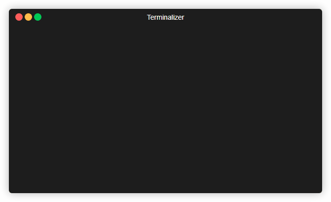

# Gendiff

Herramienta de línea de comandos que compara dos archivos de configuración (JSON) y muestra sus diferencias.

## Instalación
## Uso
### Opciones

- `-V, --version` - Muestra la versión del programa
- `-h, --help` - Muestra la ayuda
- `-f, --format <type>` - Formato de salida

### Ejemplo
## Demostración

